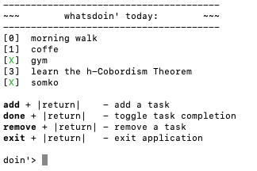

# whatsdoin
"whats doin'?" ... "not much, yourself?"


***whatsdoin*** is a rudimentary CLI todo list. The user can add and remove tasks, as well as toggle task completion.

<p align="center">
  
</p>

###  About
I began this project after learning basic C++ control flow ([learncpp.com - Chapter 8](https://www.learncpp.com/cpp-tutorial/control-flow-introduction/)). I intend on updating this project as I learn more about the language and programming in general.

### Build/Install
A short guide on building and installing (assuming Cmake is installed):
* Run ```cmake -S . -B ./build``` from the ```whatsdoin/``` directory. 
* In the ```whatsdoin/build/```, running in ```sudo make install``` in terminal should install to ```/usr/local/bin/whatsdoin``` on Linux/Unix systems. 
* Type ```whatsdoin``` in terminal to open a todo list. 